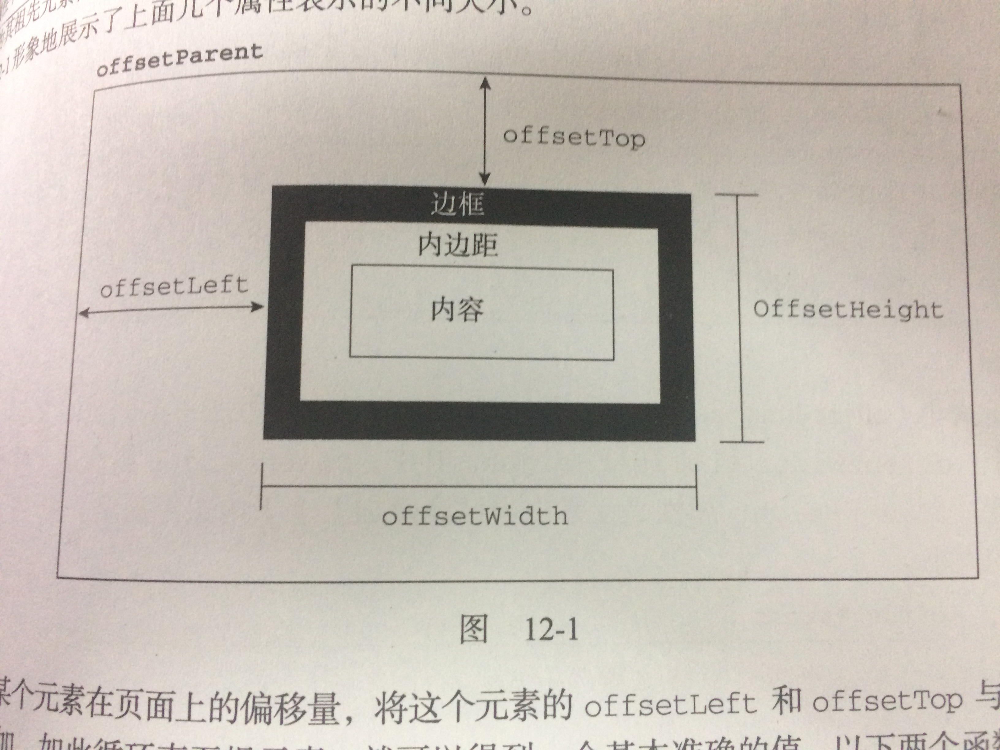

## 知识点整理

> 来自高程第12章12.2.3 元素大小

### 偏移量

所谓偏移量，包括元素在屏幕上占用的所右可见的空间。元素的可见大小是由其高度和宽度决定，包括内边距、滚动条和边框大小(注意：不是外边距)。通过下面4个属性。

* offsetHeight: 元素在垂直方向上占用的空间大小，以像素计。包括元素的高度、(可见的)水平滚动条的高度、padding-top、padding-bottom、boder-top、border-bottom。

* offsetWidth: width、padding-left、padding-right、border-left、border-right、(可见的)垂直滚动条的宽度。

* offsetLeft: 元素的左外边框 至 包含元素的左内边框之间的像素距离。

* offsetTop: 元素的上外边框 至 包含元素的上内边框之间的像素距离。

其中，offsetLeft和offsetTop属性与包含元素有关，包含元素的引用保存在offsetParent属性中，offsetParent 属性不一定与parentNode的值相等。比如，< td>元素的offsetParent是作为其祖先元素的< table>元素，因为< table>是在DOM层次中距< td> 最近的一个具有大小的元素。

示意图:



如果想要知道某个元素在页面中的偏移量，将这个元素的offsetLeft和offsetTop与其offsetParent的相同属性相加，如此循环到根元素，就可以得到一个基本准确的值。 

```
function getElementLeft(element) {
	var actualLeft = element.offsetLeft;
	var current = element.offsetParent;

	while(current != null) {
		actualLeft += current.offsetLeft;	
		current = current.offsetParent;
	}

	return actualLeft;
}
```

### 客户区大小


元素的客户区大小，指的是元素内容及其内边距所占据的空间大小，因此滚动条占用的空间不计算在内，因此可以说，使用document.documentElement.clientHeight来确定浏览器视口的大小。

* clientWidth: width + padding-left + padding-right

* clientHeight: height + padding-top + padding-bottom

与偏移量相似，客户区的大小也是只读的，也是每次访问都要重新计算的。

### 滚动大小


所谓滚动大小，指的是包含滚动内容的元素的大小。下面是4个与滚动大小相关的属性。

* scrollHeight: 在没有滚动条的时候，元素内容的总高度。

* scrollWidth: 在没有滚动条的时候，元素内容的总宽度。

* scrollLeft: 被隐藏在内容区域左侧的像素数。通过设置这个属性可以改变滚动元素的滚动位置。

* scrollTop: 被隐藏在内容区域上方的像素数。通过设置这个属性可以改变滚动元素的滚动位置。

scrollWidth和scrollHeight主要用于确定元素内容的实际大小。通常认为< html> 元素是在Web浏览器的视口中滚动的元素。因此，带有垂直滚动条的页面总高度就是document.documentElement.scrollHeight。

对于不包含滚动条的页面而言，scrollWidth和scrollHeight与clienWidth和clientHeight之间的关系并不清晰，这种情况下，不同浏览器的解析是不一致的，但是大体上可以认为它们的大小差不多。(这是我说的，并没有实践过。)

因此，在确定文档的总高度时，应该保证取scrollHeight和clientHeight中的最大值。

```
var docHeight = Math.max(document.documentElement.scrollHeight, 
						 document.documentElement.clientHeight);
```

关于scrollLeft和scrollTop, 经常页面上用到的回到顶部的效果就是这么做的：

```
if(element.scrollTop != 0) {
	element.scrollTop = 0;	
}
```

## 关于图片懒加载的几个知识点

* 屏幕可视窗口大小

	window.innerHeight(IE9+)
	
	document.documentElement.clientHeight

* 浏览器窗口顶部与文档顶部之间的距离

	window.pageYOffset;

	document.documentElement.scrollTop;

* 获取元素尺寸的大小

	* o.style.width(要求内联样式)

	* o.style.width + o.style.padding

	* o.offsetWidth = o.style.width + o.style.padding + o.style.border
	
	* o.style.width + o.style.padding + o.style.margin + o.style.border

	* 如果想要获得外部样式，则要用o.currentStyle['属性名'] 或 document.defaultView.getComputedStyle(0)['属性名']

* 获取元素的位置信息(距离浏览器顶部或距离浏览器左部的距离)

	* x.offsetTop

	* x.offsetLeft

## 如何判断元素在可视区域呢？

水平方向上满足两个条件, 同理，垂直方向上也要满足两个条件。

* 元素的左边界得在可视区域的左边界里。

* 元素的右边界得在可视区域地右边界里。


